# Cyber Jellyfish

English | [中文](./README_CN.md)

A dynamic cyber jellyfish animation project based on Python and Pygame.

## Demos

### Default Configuration

**Parameters**: `x: -10000~10000, y: -46~200` (optimized for higher frame rate)


### Parameter Variations

#### Symmetric Configurations

| Configuration                             | Preview                                            | Description                            |
| ----------------------------------------- | -------------------------------------------------- | -------------------------------------- |
| `x: -15~15, y: -15~15`                    |      | Compact, concentrated pattern          |
| `x: -1000~1000, y: -15~15`                | 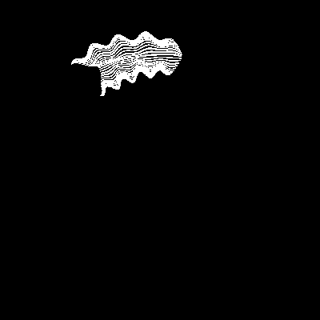       | Horizontally stretched, narrow pattern |
| `x: -100000000000~100000000, y: -100~100` | 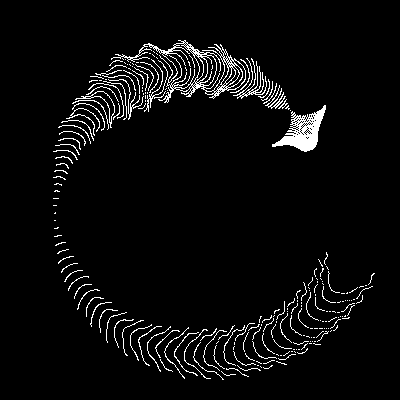 | Extreme asymmetric X with symmetric Y  |
| `x: -1000~1000, y: -500~500`              | 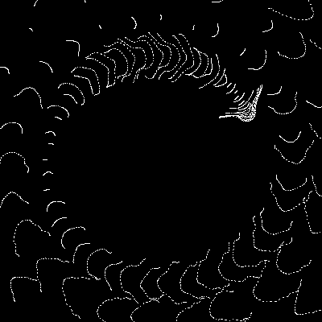     | Moderate range, balanced patterns      |

#### Asymmetric Configurations

| Configuration                  | Preview                                                      | Description                           |
| ------------------------------ | ------------------------------------------------------------ | ------------------------------------- |
| `x: 1~2, y: -5~10`             | 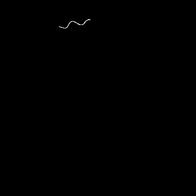               | Tiny positive X with mixed Y range    |
| `x: -100000~1000000, y: -2~-1` | 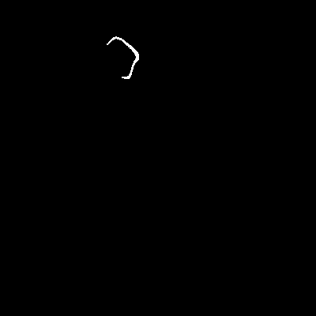 | Extreme X range with small negative Y |
| `x: -100~100, y: 5~10`         | 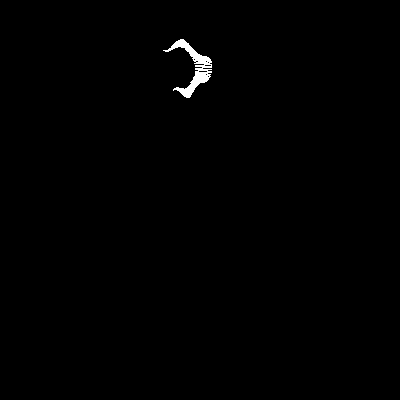         | Small positive Y range                |
| `x: -10~0, y: -46~200`         | 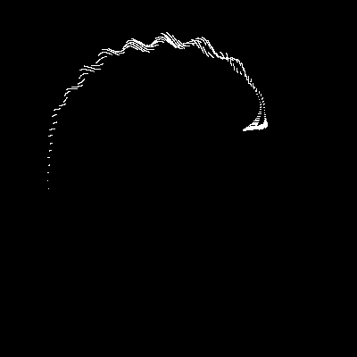          | Negative X range with positive Y bias |

#### Geometric Shape Variations

| Shape Type                 | Preview                                        | Description                       |
| -------------------------- | ---------------------------------------------- | --------------------------------- |
| Triangle Grid              | 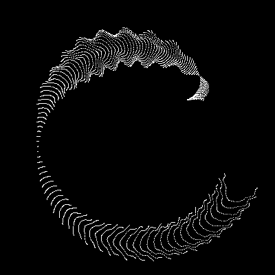 | Triangle-shaped jellyfish pattern |
| Circular Grid              | 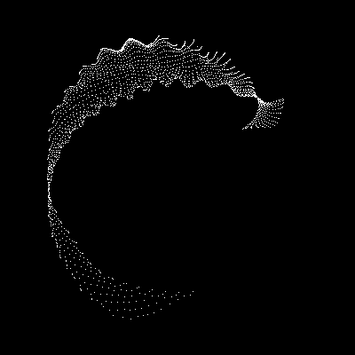     | Circular jellyfish pattern        |
| 5-Pointed Star             |          | Star-shaped jellyfish             |
| Diamond (45° Rotation)     | 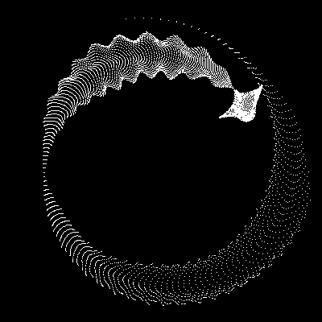   | Diamond-shaped jellyfish          |
| Tilted Grid (30° Rotation) | 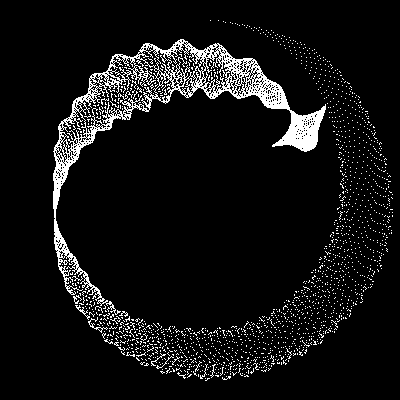     | Tilted rectangular grid           |

#### Advanced Non-Regular Grids

| Pattern Type             | Preview                                     | Description                          |
| ------------------------ | ------------------------------------------- | ------------------------------------ |
| Concentric Rings         | 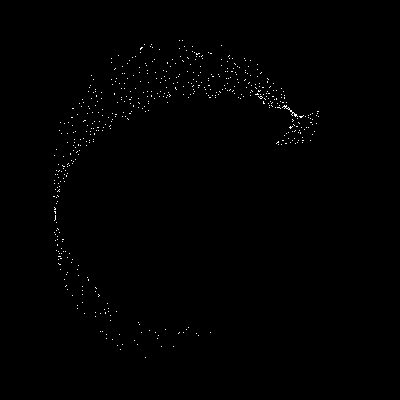   | Multi-layered ring structures        |
| Random Clusters          | 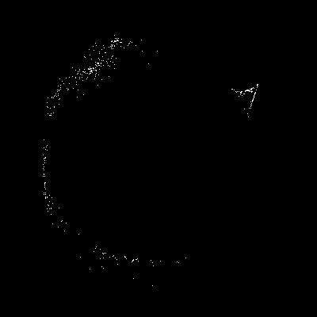 | Randomly distributed cluster regions |
| Koch Snowflake (Fractal) |  | Self-similar fractal pattern         |
| Spiral Galaxy            | 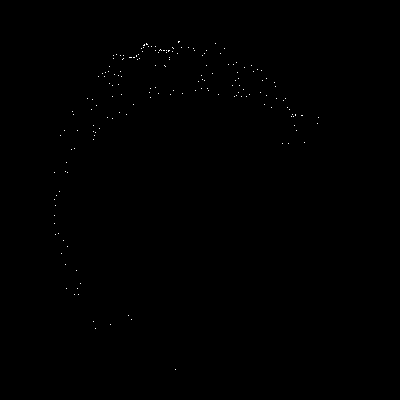     | Multi-arm spiral structure           |
| Voronoi Regions          | 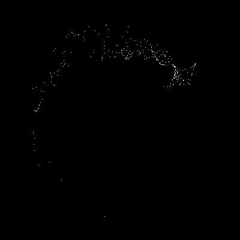  | Irregular cellular regions           |

## Features

- 🌊 Smooth real-time animation effects
- 🎨 Minimalist black and white visual style
- 💫 Organic forms driven by mathematical functions
- 🖥️ High-resolution rendering
- ⚡ Smooth 120fps experience

## Requirements

- Python 3.6+
- pygame
- numpy

## Installation

```bash
pip install pygame numpy
```

## Usage

```bash
python draw.py
```

## Technical Principles

This animation uses complex mathematical transformations to simulate jellyfish swimming:

- Creates organic morphological changes through trigonometric and exponential functions
- Uses grid point transformations to generate smooth animation effects
- Real-time calculation of particle positions for each frame

### Core Mathematical Formulas

The jellyfish animation is generated through the following mathematical transformations:

$$k = 5 \cdot \cos\left(\frac{x}{14}\right) \cdot \cos\left(\frac{y}{30}\right)$$

$$e = \frac{y}{8} - 13$$

$$d = \frac{k^2 + e^2}{59} + 4$$

$$a = \arctan2(e, k)$$

$$q = 60 - \sin(a \cdot e) + k \cdot \left(3 + \frac{4}{d} \cdot \sin(d^2 - 2t)\right)$$

$$c = \frac{d}{2} + \frac{e}{99} - \frac{t}{18}$$

$$X = (q + 2d) \cdot \sin(c) \cdot \text{scale} + \text{center}_x$$

$$Y = (q + 2d) \cdot \cos(c) \cdot \text{scale} + \text{center}_y$$

Where:

- `(x, y)` are the initial grid coordinates
- `t` is the time parameter (frame/30.0)
- `scale` controls the size (default: 1.8)
- `center_x, center_y` are the screen center coordinates

## Parameter Description

### New Asymmetric Range Parameters

- `limit_x_min, limit_x_max`: X-axis range (supports asymmetric ranges)
- `limit_y_min, limit_y_max`: Y-axis range (supports asymmetric ranges)
- `generate_demo`: Boolean flag to enable demo GIF generation

### GIF Generation Parameters

- `gif_fps`: GIF frame rate (frames per second, recommended: 10-30)
- `gif_duration_seconds`: GIF total duration in seconds (recommended: 2-8)
- **Note**: Higher frame rate + longer duration = larger file size + slower generation

### Other Parameters

- `grid_size`: Controls rendering precision, higher values for more detail
- `scale`: Controls jellyfish size
- `screen_size_x/y`: Window dimensions
- `clock.tick()`: Controls real-time frame rate (for interactive display)

### Usage Examples

```python
# Symmetric range (traditional)
limit_x_min = -100
limit_x_max = 100

# Asymmetric range (new feature)
limit_x_min = -50
limit_x_max = 200

# Enable demo generation with custom frame rate
generate_demo = True
gif_fps = 20  # Higher frame rate for smoother animation
gif_duration_seconds = 3  # Shorter duration for smaller file

# Different quality settings
# High quality (smooth but large file)
gif_fps = 30
gif_duration_seconds = 5

# Low quality (fast generation, small file)
gif_fps = 10
gif_duration_seconds = 2
```

## Contributing

Welcome to submit Issues and Pull Requests to improve this project!

## License

MIT License

idea 来源互联网 实现由 claude agent 完成
