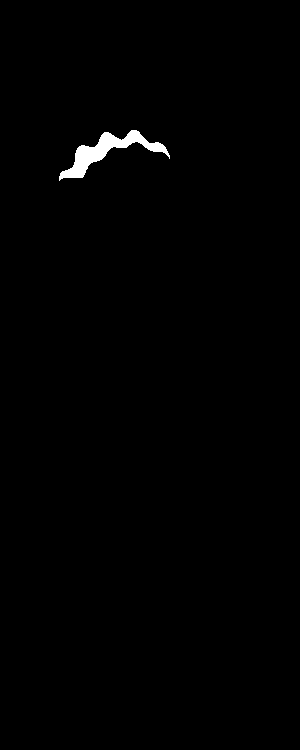
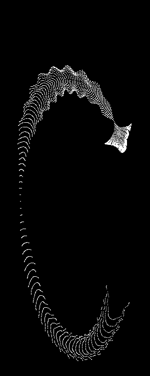

# Cyber Jellyfish

English | [中文](./README_CN.md)

A dynamic cyber jellyfish animation project based on Python and Pygame.

## Demos

### Default Configuration


### Parameter Variations

Our mathematical transformation supports asymmetric parameter ranges for more diverse patterns:

| Configuration                              | Preview                                | Description                            |
| ------------------------------------------ | -------------------------------------- | -------------------------------------- |
| `x[-15, 15], y[-15, 15]`                   |                | Compact, concentrated pattern          |
| `x[-11111111195, 11111111195], y[-15, 15]` |                  | Horizontally stretched, narrow pattern |
| `x[-11111111195, 11111111195], y[-95, 95]` |            | Current default configuration          |
| `x[-500, 500], y[-500, 500]`               |             | Moderate range, balanced patterns      |
| `x[-500, 500], y[-500, 100]`               |  | Y-axis asymmetric, negative extension  |
| `x[0, 1000], y[-250, 250]`                 |  | X-axis asymmetric, positive offset     |
| `x[0, 500], y[0, 500]`                     |            | First quadrant pattern                 |

## Features

- 🌊 Smooth real-time animation effects
- 🎨 Minimalist black and white visual style
- 💫 Organic forms driven by mathematical functions
- 🖥️ High-resolution rendering
- ⚡ Smooth 120fps experience

## Requirements

- Python 3.6+
- pygame
- numpy

## Installation

```bash
pip install pygame numpy
```

## Usage

```bash
python draw.py
```

## Technical Principles

This animation uses complex mathematical transformations to simulate jellyfish swimming:

- Creates organic morphological changes through trigonometric and exponential functions
- Uses grid point transformations to generate smooth animation effects
- Real-time calculation of particle positions for each frame

### Core Mathematical Formulas

The jellyfish animation is generated through the following mathematical transformations:

$$k = 5 \cdot \cos\left(\frac{x}{14}\right) \cdot \cos\left(\frac{y}{30}\right)$$

$$e = \frac{y}{8} - 13$$

$$d = \frac{k^2 + e^2}{59} + 4$$

$$a = \arctan2(e, k)$$

$$q = 60 - \sin(a \cdot e) + k \cdot \left(3 + \frac{4}{d} \cdot \sin(d^2 - 2t)\right)$$

$$c = \frac{d}{2} + \frac{e}{99} - \frac{t}{18}$$

$$X = q \cdot \sin(c) \cdot \text{scale} + \text{center}_x$$

$$Y = (q + 9d) \cdot \cos(c) \cdot \text{scale} + \text{center}_y$$

Where:

- `(x, y)` are the initial grid coordinates
- `t` is the time parameter (frame/30.0)
- `scale` controls the size (default: 1.8)
- `center_x, center_y` are the screen center coordinates

## Parameter Description

- `grid_size`: Controls rendering precision, higher values for more detail
- `scale`: Controls jellyfish size
- `screen_size_x/y`: Window dimensions
- `clock.tick()`: Controls frame rate

## Contributing

Welcome to submit Issues and Pull Requests to improve this project!

## License

MIT License

idea 来源互联网 实现由 claude agent 完成
