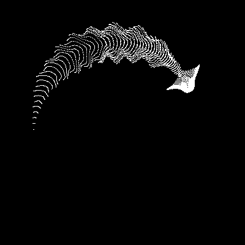
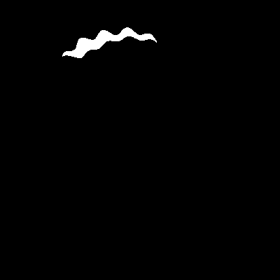

# Cyber Jellyfish

English | [中文](./README_CN.md)

A dynamic cyber jellyfish animation project based on Python and Pygame.

## Demos

### Default Configuration



### Parameter Variations

#### Symmetric Configurations

| Configuration              | Preview                              | Description                            |
| -------------------------- | ------------------------------------ | -------------------------------------- |
| `x: -15~15, y: -15~15`     |  | Compact, concentrated pattern          |
| `x: extreme, y: -15~15`    |    | Horizontally stretched, narrow pattern |
| `x: extreme, y: -100~100`  |    | Current default configuration          |
| `x: -500~500, y: -500~500` |  | Moderate range, balanced patterns      |

#### Asymmetric Configurations

| Configuration                | Preview                                     | Description               |
| ---------------------------- | ------------------------------------------- | ------------------------- |
| `x: -200~800, y: -50~150`    |  | Asymmetric X and Y ranges |
| `x: 0~1000, y: -100~100`     |     | X-axis positive offset    |
| `x: extreme, y: 0~200`       |     | Y-axis positive offset    |
| `x: -100~100, y: -1000~1000` |           | Tall, narrow shape        |

## Features

- 🌊 Smooth real-time animation effects
- 🎨 Minimalist black and white visual style
- 💫 Organic forms driven by mathematical functions
- 🖥️ High-resolution rendering
- ⚡ Smooth 120fps experience

## Requirements

- Python 3.6+
- pygame
- numpy

## Installation

```bash
pip install pygame numpy
```

## Usage

```bash
python draw.py
```

## Technical Principles

This animation uses complex mathematical transformations to simulate jellyfish swimming:

- Creates organic morphological changes through trigonometric and exponential functions
- Uses grid point transformations to generate smooth animation effects
- Real-time calculation of particle positions for each frame

### Core Mathematical Formulas

The jellyfish animation is generated through the following mathematical transformations:

$$k = 5 \cdot \cos\left(\frac{x}{14}\right) \cdot \cos\left(\frac{y}{30}\right)$$

$$e = \frac{y}{8} - 13$$

$$d = \frac{k^2 + e^2}{59} + 4$$

$$a = \arctan2(e, k)$$

$$q = 60 - \sin(a \cdot e) + k \cdot \left(3 + \frac{4}{d} \cdot \sin(d^2 - 2t)\right)$$

$$c = \frac{d}{2} + \frac{e}{99} - \frac{t}{18}$$

$$X = q \cdot \sin(c) \cdot \text{scale} + \text{center}_x$$

$$Y = (q + 9d) \cdot \cos(c) \cdot \text{scale} + \text{center}_y$$

Where:

- `(x, y)` are the initial grid coordinates
- `t` is the time parameter (frame/30.0)
- `scale` controls the size (default: 1.8)
- `center_x, center_y` are the screen center coordinates

## Parameter Description

### New Asymmetric Range Parameters

- `limit_x_min, limit_x_max`: X-axis range (supports asymmetric ranges)
- `limit_y_min, limit_y_max`: Y-axis range (supports asymmetric ranges)
- `generate_demo`: Boolean flag to enable demo GIF generation

### Other Parameters

- `grid_size`: Controls rendering precision, higher values for more detail
- `scale`: Controls jellyfish size
- `screen_size_x/y`: Window dimensions
- `clock.tick()`: Controls frame rate

### Usage Examples

```python
# Symmetric range (traditional)
limit_x_min = -100
limit_x_max = 100

# Asymmetric range (new feature)
limit_x_min = -50
limit_x_max = 200

# Enable demo generation
generate_demo = True
```

## Contributing

Welcome to submit Issues and Pull Requests to improve this project!

## License

MIT License

idea 来源互联网 实现由 claude agent 完成
