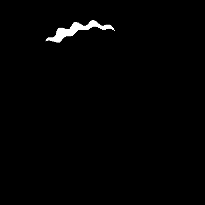
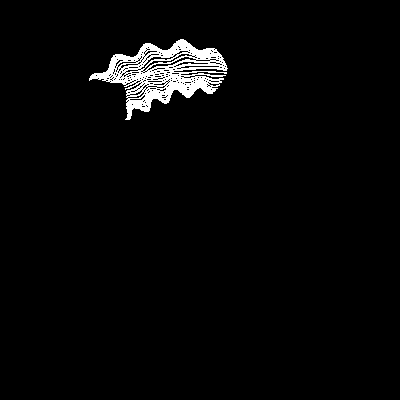
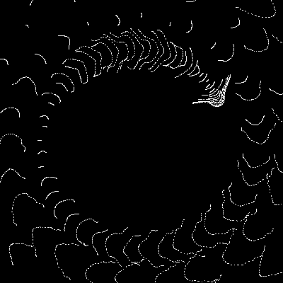
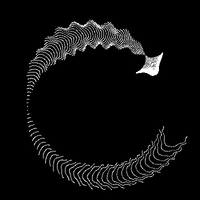
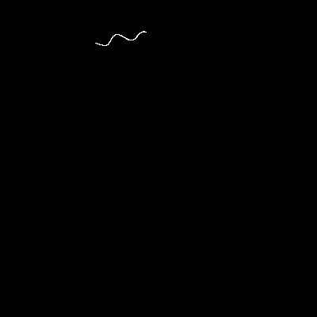
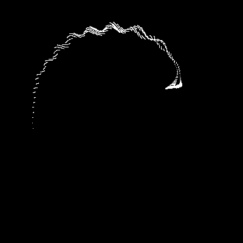
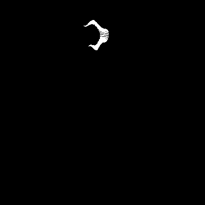
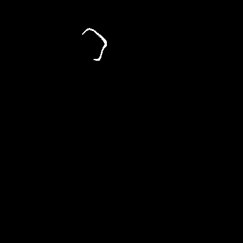

# 赛博水母 (Cyber Jellyfish)

中文 | [English](./README.md)

一个基于 Python 和 Pygame 的动态赛博电子水母动画项目。

## 演示

### 默认配置

**参数配置**: `x: -10000~10000, y: -46~200` (优化的高帧率配置)


### 参数变化效果

#### 对称配置

| 配置参数                                  | 预览效果                                      | 描述                     |
| ----------------------------------------- | --------------------------------------------- | ------------------------ |
| `x: -15~15, y: -15~15`                    |      | 紧凑集中的图案           |
| `x: -1000~1000, y: -15~15`                |       | 水平拉伸的窄图案         |
| `x: -1000~1000, y: -500~500`              |      | 中等范围，平衡图案       |
| `x: -100000000000~100000000, y: -100~100` |  | X 轴极度不对称，Y 轴对称 |

#### 不对称配置

| 配置参数                       | 预览效果                                         | 描述                     |
| ------------------------------ | ------------------------------------------------ | ------------------------ |
| `x: 1~2, y: 1~2`               |         | 微小正值范围             |
| `x: -10~0, y: -46~200`         |  | 负 X 范围，正 Y 偏移     |
| `x: -100~100, y: 5~10`         |         | 小的正 Y 范围            |
| `x: -100000~1000000, y: -2~-1` |  | 极大 X 范围，小负 Y 范围 |

## 特性

- 🌊 流畅的实时动画效果
- 🎨 极简的黑白视觉风格
- 💫 数学函数驱动的有机形态
- 🖥️ 高分辨率渲染
- ⚡ 120fps 流畅体验

## 运行要求

- Python 3.6+
- pygame
- numpy

## 安装依赖

```bash
pip install pygame numpy
```

## 运行

```bash
python draw.py
```

## 技术原理

这个动画使用复杂的数学变换来模拟水母的游动：

- 通过三角函数和指数函数创建有机的形态变化
- 使用网格点变换来生成流畅的动画效果
- 实时计算每一帧的粒子位置

### 核心数学公式

水母动画通过以下数学变换生成：

$$k = 5 \cdot \cos\left(\frac{x}{14}\right) \cdot \cos\left(\frac{y}{30}\right)$$

$$e = \frac{y}{8} - 13$$

$$d = \frac{k^2 + e^2}{59} + 4$$

$$a = \arctan2(e, k)$$

$$q = 60 - \sin(a \cdot e) + k \cdot \left(3 + \frac{4}{d} \cdot \sin(d^2 - 2t)\right)$$

$$c = \frac{d}{2} + \frac{e}{99} - \frac{t}{18}$$

$$X = (q + 2d) \cdot \sin(c) \cdot \text{scale} + \text{center}_x$$

$$Y = (q + 2d) \cdot \cos(c) \cdot \text{scale} + \text{center}_y$$

其中：

- `(x, y)` 是初始网格坐标
- `t` 是时间参数 (frame/30.0)
- `scale` 控制大小 (默认: 1.8)
- `center_x, center_y` 是屏幕中心坐标

## 参数说明

### 新的不对称范围参数

- `limit_x_min, limit_x_max`: X 轴范围（支持不对称范围）
- `limit_y_min, limit_y_max`: Y 轴范围（支持不对称范围）
- `generate_demo`: 布尔标志，启用演示 gif 生成

### 其他参数

- `grid_size`: 控制渲染精度，数值越大越细腻
- `scale`: 控制水母大小
- `screen_size_x/y`: 窗口尺寸
- `clock.tick()`: 控制帧率

### 使用示例

```python
# 对称范围（传统方式）
limit_x_min = -100
limit_x_max = 100

# 不对称范围（新功能）
limit_x_min = -50
limit_x_max = 200

# 启用演示生成
generate_demo = True
```

## 贡献

欢迎提交 Issues 和 Pull Requests 来改进这个项目！

## 许可证

MIT License
